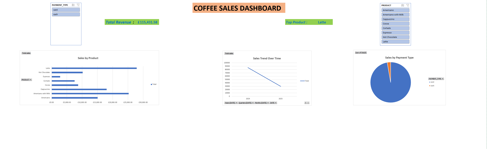

# # ☕ Coffee Sales Dashboard (Excel)

## 📊 Project Overview

This project focuses on analysing coffee shop sales data using Microsoft Excel.
The goal was to clean raw data, perform analysis, and build an interactive dashboard to identify key business insights.

---

## 🛠 Tools & Skills Used

* Microsoft Excel
* Data Cleaning
* Pivot Tables
* Data Analysis
* Charts & Visualisation
* Slicers (Interactive Filters)

---

## 📁 Dataset

The dataset contains transactional coffee sales data including:

* Date & Time
* Product (coffee type)
* Payment Type (card/cash)
* Sales amount

---

## 📈 Key Analysis Performed

* Sales by Product
* Sales Trend Over Time
* Sales by Payment Type
* Total Revenue Calculation

---

## 📊 Dashboard Features

* Interactive filtering using slicers
* KPI metrics (Total Revenue, Top Product)
* Product performance comparison
* Sales trend visualisation
* Payment method distribution

---

## 🔍 Key Insights

* Latte is the highest revenue-generating product
* Americano with Milk is the second top performer
* Card payments dominate transactions
* Sales trend remains relatively consistent over time

---

## 📸 Dashboard Preview

---

## 📂 Files Included

* `Coffee_Sales_Dashboard.xlsx` → Excel dashboard file
* `Dashboard.png.png` → Dashboard screenshot

---

## 🚀 What I Learned

* How to clean and prepare raw data
* Building Pivot Tables for analysis
* Creating interactive dashboards in Excel
* Presenting insights in a clear and structured way

---

## 💼 Future Improvements

* Build the same dashboard using Power BI
* Add advanced metrics and KPIs
* Automate data updates

---

## 👤 Author

**Srinivasa Reddy Polaka**
